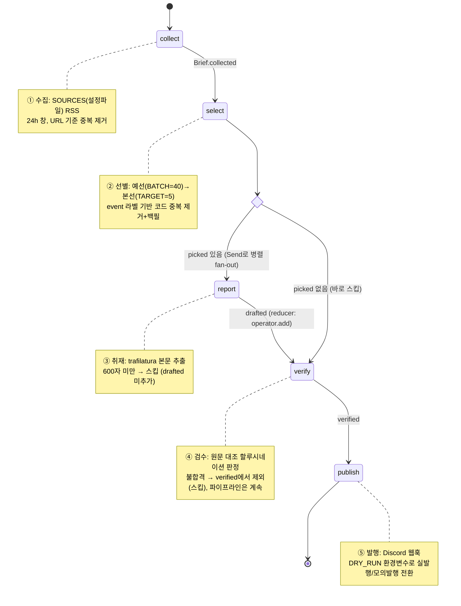
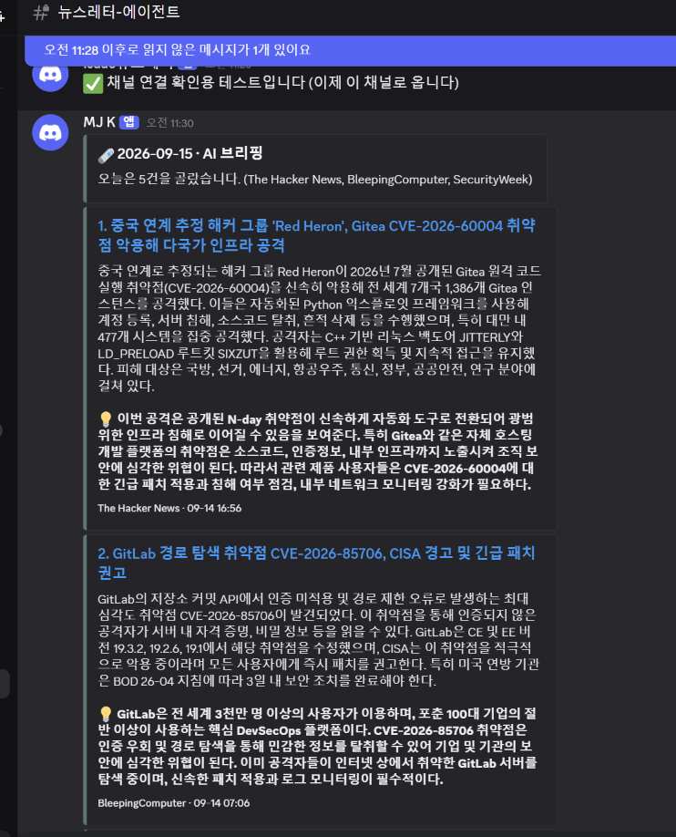

# REPORT — 보안 뉴스레터 에이전트

이 저장소는 LangGraph 기반 뉴스레터 에이전트 하나로 **AI 주제**(`audience.yaml`)와
**보안 주제**(`audience_security.yaml`)를 동시에 운영한다. 이번 프로젝트 제출은
과제에서 제외를 요구한 소스 목록(OpenAI/DeepMind/TechCrunch/The Verge/MIT TR/AI타임스)과
겹치지 않는 **보안 브리핑** 쪽을 대상으로 한다. `AUDIENCE_CONFIG=audience_security.yaml`
환경변수 하나로 같은 코드(`graph.py`)가 이 주제로 동작한다.

- 실행: `AUDIENCE_CONFIG=audience_security.yaml python run.py [--dry-run]`
- 자동 실행: `.github/workflows/security.yml` (매일 07:40 KST)
- 지표: `store/metrics_audience_security.jsonl`
- 발행 채널: 기본은 Discord, `PUBLISH_CHANNEL=email`로 전환하면 같은 파이프라인이
  이메일로 발행한다 (6번 항목 참고) — 그래프 조립·수집·선별·요약·검수는 채널과
  무관하게 그대로다.

---

## 1. 분야 및 독자 정의

**분야**: 보안 취약점·침해사고 브리핑

**선택 배경**: 커리큘럼 예제가 다루는 "AI 산업 동향"과 성격이 다른 분야를 골라
파이프라인이 정말로 도메인에 무관하게 재사용되는지 검증하고 싶었다. 실제로
AI 주제 → 보안 주제로 바꾸면서 손봐야 했던 건 수집(소스)·선별(기준)·요약(작성지침)
세 곳뿐이었고, 검수·발행 로직은 코드 변경 없이 그대로 동작했다.

**타깃 독자 페르소나**: 사내 인프라·서비스를 운영하는 개발팀 및 보안 담당자.
CVE, 취약점 스캐닝, 기본적인 네트워크 보안 개념은 이미 알고 있다고 가정하고,
"오늘 아침에 뭘 패치해야 하는가"에 답하는 것을 목표로 한다. 그래서 중요도 기준의
1순위는 "실제 악용(active exploitation) 여부"이고, 홍보성 기사·순수 이론 논문은
버린다 (`audience_security.yaml`의 `중요도_기준`/`버릴_것`).

---

## 2. 소스 채택표

3개 이상이라는 조건과 별개로, 후보 8곳을 동일 조건(48시간 창, RSS 응답 여부,
최신 항목 중 최대 5건에 대한 `trafilatura` 본문 추출 성공률·평균 길이)으로 실측했다.

| 소스 | RSS 응답 | 48h 내 항목 | 본문 추출(G1) | 평균 본문 길이 | 채택 여부 |
|---|---|---|---|---|---|
| The Hacker News | OK | 9 | 5/5 | 5,669자 | ✅ 채택 |
| BleepingComputer | OK | 13 | 5/5 | 3,893자 | ✅ 채택 |
| SecurityWeek | OK | 10 | 5/5 | 4,353자 | ✅ 채택 |
| Krebs on Security | OK | 0 | 5/5 (과거 항목 기준) | 21,571자 | ✅ 채택 |
| Dark Reading | OK | 3 | **0/3** | 0자 | ❌ 탈락 |
| The Record | OK | 5 | 5/5 | 3,519자 | ❌ 보류 |
| SANS ISC | OK | 2 | 1/2 | 42,770자 | ❌ 탈락 |
| Threatpost | OK | 0 | 5/5 (과거 항목 기준) | 3,779자 | ❌ 탈락 |

**탈락/보류 근거**:

- **Dark Reading — 탈락.** RSS 수집 자체는 되지만, 실제 기사 URL에 요청을 보내면
  세 건 모두 `HTTP 403`이 돌아왔다 (직접 확인:
  `requests.get(article_url)` → `403`, `trafilatura.fetch_url()` → `None`).
  즉 이 소스는 "관문은 통과하지만 실제로는 아무 것도 발행에 기여하지 못하는" 소스였다 —
  수집 노드에는 매번 항목이 잡히지만 취재 노드(`report()`)에서 본문 600자 미만으로
  전부 스킵되고 있었다. 실제로 이 상태로 며칠간 운영되고 있었던 것을 이번 실측 중에
  발견했고, 대체 소스 확보 후 `audience_security.yaml`에서 SecurityWeek으로 교체했다
  (커밋 `1ace883`).
- **Threatpost — 탈락.** 48시간 창에 항목이 0건 — RSS 피드 자체는 응답하지만 갱신이
  멈춰 있다. Threatpost는 실제로 서비스가 종료된 매체라 최신 기사가 없다는 점과
  일치한다. "피드가 응답한다"와 "살아있는 소스다"는 다른 질문이라는 걸 보여주는 사례.
- **SANS ISC — 탈락.** 48시간 내 항목 자체가 2건뿐이고, 본문 추출도 1/2로 불안정했다.
  평균 길이 42,770자는 표본 1건에 불과해 신뢰할 수 없는 수치다 — 표본이 너무 작아
  등급을 매길 근거가 안 된다.
- **The Record — 보류.** 실측 지표만 보면 나쁘지 않지만(48h 내 5건, G1 5/5),
  피드 전체 항목 수가 5건뿐이라 하루 수집량이 거의 전량 소진되는 구조다. 더 오래
  관찰해 피드 갱신 주기를 확인한 뒤 추가할 후보로 남겨둔다 (개선 아이디어 참고).
- **Krebs on Security — 채택(예외 처리 필요).** 이번 48시간 창에는 신규 게시물이
  0건이었지만, 게시 빈도가 원래 낮고(주 2~3회) 한 건당 품질(평균 21,571자, 심층
  취재)이 매우 높은 소스라 유지했다. `collect()`가 시간 창 내 항목이 없으면 그냥
  0건을 반환하고 다음 소스로 넘어가므로, 이런 "당일엔 조용하지만 유지할 가치가 있는"
  소스가 있어도 파이프라인이 멈추지 않는다.

---

## 3. 선별 로직 설계

**중요도 판단 문장** (`build_criteria()`가 `audience_security.yaml`에서 조립,
`ask_picks()`의 system prompt로 그대로 들어감):

> 독자는 사내 인프라·서비스를 운영하는 개발팀 및 보안 담당자입니다.
> 중요도 기준 (위에 있을수록 우선):
> - 실제로 악용(active exploitation) 중이거나 PoC가 공개된 취약점인가
> - 널리 쓰이는 소프트웨어·라이브러리·클라우드 서비스에 영향을 주는가
> - 지금 당장 패치·설정 변경 등 조치가 필요한가
> 버릴 것: 보안 업체 신제품 홍보/컨퍼런스 소식, 실사용 익스플로잇 없는 순수 이론 논문

**예선/본선 2단계 구조 (`select()`)**: 모델에게 "N개 중 가장 중요한 K개를 순서대로
고르라"는 요청은 후보가 한 화면(컨텍스트)에 다 들어갈 때만 신뢰할 수 있다. 후보가
많아지면 한 번에 비교하는 대신 `BATCH=40` 단위로 잘라 예선을 보고, 예선 통과자만 모아
다시 `TARGET=5`를 뽑는 본선을 돌린다 — 개수 제한 문제를 "채점"이 아니라 "정렬" 문제로
풀기 위함이다. `BATCH=40`은 이 모델(`gpt-4.1-mini`)이 제목 목록만으로도 안정적으로
비교할 수 있는 상한을 기준으로 잡았다 (커리큘럼 07번 노트의 배치 크기 실험에서 40 이상은
선발 비율이 급격히 떨어지는 것을 확인).

**실제로 기준이 의도대로 동작했다는 근거**: 오늘 실행한 `store/metrics_audience_security.jsonl`
마지막 줄을 보면 —

```json
{"run_id": "2026-09-15 11:22", "collected": 29, "picked": 5, "drafted": 5, "published": 5,
 "hours": 24, "by_source": {"The Hacker News": 2, "BleepingComputer": 1, "SecurityWeek": 2},
 "log": ["① 수집   24시간 창 · 29건", "② 선별   29 → 예선 8 → 5건",
         "④ 검수   5 → 5건", "⑤ 발행   5건 · dry-run"]}
```

`29 → 예선 8 → 5`로 로그에 단계별 감소량이 남고, `by_source`로 어떤 소스가
실제 채택으로 이어졌는지도 남는다 — Krebs가 오늘 0건인 이유(당일 게시물 없음)도
이 숫자로 바로 설명된다.

**`event` 라벨을 통한 중복 제거 (실제 운영 버그 수정)**: 각 기사에 "같은 사건이면
같은 라벨을 붙이라"고 모델에 부탁하지만, 이는 확률적으로만 지켜진다. 배포 다음 날
실제로 같은 GitLab 취약점(CVE-2026-85706)을 다룬 두 기사가 나란히 발행된 것을 발견해,
본선 결과를 `event` 기준으로 순회하며 중복이면 건너뛰고, 모자란 자리는 예선 통과분 중
새 `event`를 가진 다음 후보로 백필하도록 `select()`에 코드 레벨 필터를 추가했다:

```python
picked, seen_events, dropped_dupes = [], set(), 0
for p in finals:
    event = survivors[p.index][1]
    if event in seen_events:
        dropped_dupes += 1
        continue
    picked.append(survivors[p.index][0])
    seen_events.add(event)
# 중복 제거로 모자란 자리는 예선 통과분 중 새 event로 백필
final_idx = {p.index for p in finals}
for i, (it, event) in enumerate(survivors):
    if len(picked) >= TARGET:
        break
    if i in final_idx or event in seen_events:
        continue
    picked.append(it)
    seen_events.add(event)
```

---

## 4. 파이프라인 구조도



State(`Brief`)는 `collected`/`picked`/`drafted`(reducer)/`verified`/`log`(reducer) 다섯
칸이다. `report`만 `Send`로 여러 개가 동시에 실행되기 때문에 `drafted`와 `log`에
`Annotated[list, operator.add]` 리듀서가 필요하고, 나머지 키는 단일 노드가 한 번만
쓰므로 리듀서 없이 그냥 덮어쓴다.

---

## 5. 실행 기록

**엔드투엔드 실행 (dry-run, 2026-09-15 11:22 KST, 소스 교체 반영 후)**:

```
[dry-run] embed 6개 · 4549자 — 보내지 않음
① 수집   24시간 창 · 29건
② 선별   29 → 예선 8 → 5건
④ 검수   5 → 5건
⑤ 발행   5건 · dry-run
```

29건 수집 → 예선 8건 → 본선 5건 → 검수 통과 5건 → 발행까지 오류 없이
end-to-end로 완료됐다. 원본 데이터는 `store/metrics_audience_security.jsonl`에
누적 기록된다.

**실제 발행 화면**:



`security.yml` 워크플로가 매일 07:40 KST에 자동 실행되어 실제로 Discord에
발행하고 있다 (username `MJ K`). 이 스크린샷은 그 중 한 회차의 실제 발행
결과인데, **1번 기사("Red Heron", Gitea CVE-2026-60004)가 바로 아래
"검수 로직이 실제로 동작하는지" 절에서 다루는 사례와 같은 기사다** — 처음
검수 프롬프트로는 이 요약이 통과되어 실제로 발행까지 됐지만, 프롬프트를
보강한 뒤 다시 돌려보니 원문에 없는 과장(추정을 단정으로 바꾼 표현, 국가 수
부풀리기 등)이 있다는 게 걸러졌다. 즉 이 스크린샷은 "잘 된 예시"가 아니라
**검수 로직의 실제 한계를 보여주는 증거**로 남겨둔다.

**검수(④) 로직이 실제로 할루시네이션을 잡아내는지 검증**: 지금까지 쌓인
실행 기록 7회를 전부 확인해보니 검수가 단 한 번도 무언가를 불합격시킨 적이
없었다 (`store/metrics_audience.jsonl`, `store/metrics_audience_security.jsonl`
전체 이력에서 매번 N→N). "한 번도 안 걸렀다"가 "로직이 잘 작동해서"인지
"애초에 못 거르는 로직이라서"인지 구분이 안 되므로, 실제 기사로 직접
검증했다.

1) 정상 요약에 원문에 없는 문장(가짜 CVSS 9.9점, 랜섬웨어 조직의 실제 악용,
   정부기관 3곳 피해)을 의도적으로 추가해 기존 검수 프롬프트(`요약이
   원문에서 뒷받침되는지 판정하세요`)에 넣어봤더니 **`ok=True`로 통과**했다
   — 검수가 사실상 아무 것도 못 거르고 있었다는 뜻이다.
2) `SYS_CHECK`를 "문장 단위로 쪼개어 원문과 대조하고, 수치·고유명사·
   '이미 악용됨' 같은 새 사실 주장은 반드시 불합격 처리"하도록 구체화했다.
3) 같은 조작된 요약을 새 프롬프트로 다시 넣자 **`ok=False`**로 정확히
   잡혔고 (`problems`: "CVSS 9.9점" 항목과 "랜섬웨어 조직 피해" 항목을
   각각 원문에 없다고 지적), 정상 요약과 단위 환산만 바꾼 요약(`200달러` →
   `약 27만원`)은 여전히 `ok=True`로 통과해 회귀도 없었다.
4) 고친 프롬프트로 **오늘자 실제 수집 데이터를 다시 돌리자, 인위적 조작 없이도
   자연스럽게 한 건이 걸러졌다** (`④ 검수   5 → 4건 · 불합격 ['SecurityWeek']`).
   별도로 재현했을 때는 위 스크린샷의 "Red Heron" 기사(The Hacker News)가
   걸러졌는데, 실제 지적된 문제는:
   - 원문은 "Red Heron **scanned** 1,386 Gitea instances across seven countries"
     인데 요약은 "1,386개 인스턴스를 **공격했다**"로 바꿔 스캔과 공격을 혼동
   - 원문에는 6개국만 명시되어 있는데 요약은 "7개국"으로 부풀림
   - "피해 발생 여부가 명확하지 않다"고 되어 있는 여러 문장(백도어 활용,
     루트 권한 침투, 추가 공격 대상)을 요약이 확정형으로 서술
   - 원문에 없는 보안 권고 문장을 요약이 임의로 추가

   같은 세트의 다른 기사(GitLab CVE-2026-85706, BleepingComputer)는 원문과
   대조해도 문제가 없어 정상 통과했다 — 검수가 소스 자체를 차별하는 게 아니라
   문장 단위로 실제 근거를 대조하고 있다는 뜻이다.

수정한 프롬프트는 `graph.py`(커밋 참고)에 반영했고, 이 발견·수정 전 과정은
"모델에게 지시했다"와 "실제로 그렇게 동작한다"가 다르다는 걸 검수 단계에서도
직접 확인한 사례로 남긴다.

**예외 처리가 실제로 동작한 사례**: Krebs on Security는 특정 실행에서 24시간
창에 게시물이 없어 `collected`에 0건으로 반영됐지만, 다른 소스가 채워 5건
목표를 그대로 채웠다 — 소스 하나가 조용해도, 그리고 검수에서 한 건이 빠져도
(`5 → 4건`), 파이프라인은 멈추지 않고 남은 건수로 발행을 완료한다는 걸
실제 데이터로 확인했다.

---

## 6. 다른 발행 채널 지원 (이메일)

과제 안내에서 "LangGraph를 꼭 안 써도 되고, 발행 채널도 Discord 외에 이메일·텔레그램·
카카오 오픈톡 등 자유롭게 선택 가능"이라는 안내가 있어, 실제로 발행 채널을 바꿔도
파이프라인의 나머지가 코드 변경 없이 재사용되는지 검증해봤다.

**구현**: `_build_articles()`로 "검수 통과 기사에서 무엇을 보낼지"를 채널과 무관하게
공통으로 뽑아내고, Discord용 `publish()`와 이메일용 `publish_email()`(`build_email_html()`
+ `send_email()`, `smtplib` 사용)이 이 결과를 각자의 포맷으로만 바꿔서 보낸다.
`build()`는 `PUBLISH_CHANNEL` 환경변수 값으로 그래프에 꽂을 발행 노드만 바꿔 끼운다 —
`collect`·`select`·`report`·`verify` 네 노드와 그래프 모양은 한 글자도 건드리지 않는다.

```python
publish_node = publish_email if os.environ.get("PUBLISH_CHANNEL") == "email" else publish
```

**실행 결과 (같은 실행 데이터, 채널만 다름, dry-run)**:

```
# 기본값(Discord)
[dry-run] embed 5개 · 3860자 — 보내지 않음
① 수집   24시간 창 · 29건
② 선별   29 → 예선 8 → 5건
④ 검수   5 → 4건 · 불합격 ['BleepingComputer']
⑤ 발행(Discord)   4건 · dry-run

# PUBLISH_CHANNEL=email
[dry-run] 이메일 · 제목='[보안 브리핑] 2026-09-15 — 5건' · 수신자='(미설정)' · 본문 4846자 — 보내지 않음
① 수집   24시간 창 · 29건
② 선별   29 → 예선 8 → 5건
④ 검수   5 → 5건
⑤ 발행(이메일)   5건 · dry-run
```

①~④ 단계는 완전히 동일한 코드 경로를 지나고(수치가 다른 건 검수가 실행마다
독립적으로 판단하기 때문), ⑤만 노드가 교체된다. `SMTP_HOST`/`SMTP_USER`/`SMTP_PASS`/
`MAIL_TO`를 설정하면 실제 발송도 가능하지만, 이번 제출에서는 구조와 dry-run 동작만
검증했다 — 실제 메일 발송은 별도의 SMTP 계정 준비가 필요해 범위 밖으로 남겨둔다.

부수적으로, 이 작업을 하며 Discord 임베드 제목이 주제와 무관하게 "AI 브리핑"으로
하드코딩되어 있던 것도 발견해 `audience.yaml`/`audience_security.yaml`의 `브리핑명`
값에서 가져오도록 고쳤다 (`BRIEF_NAME = CFG.get("브리핑명", "브리핑")`) — 이전
스크린샷(5번 항목)에 남아있는 "AI 브리핑"이라는 제목이 바로 이 버그의 증거다.

---

## 7. 프로젝트 회고

**가장 공들인 부분**: "프롬프트에 적은 부탁은 확률적으로만 지켜진다"는 걸 실제
운영에서 세 번 직접 겪고 코드로 보강한 것.
1. 소스 신뢰도 문제 — Dark Reading이 403으로 막혀 있는데 아무도 모르고 있었던 것
   (로그만 봐서는 드러나지 않고 실제로 URL을 두드려봐야 알 수 있었다).
2. `select()`의 `event` 중복 발행 버그 — 모델에게 "같은 사건은 하나만 고르라"고
   했지만 실제 발행에서 지켜지지 않아 코드로 강제했다.
3. 검수(④) 로직 자체가 할루시네이션을 못 거르고 있던 문제 — 지금까지 단 한 번도
   불합격이 없었던 게 "잘 동작해서"가 아니라 "애초에 못 거르는 프롬프트"였기
   때문이라는 걸 의도적 조작 테스트로 확인하고 프롬프트를 문장 단위 대조로
   바꿨다. 고치고 나니 실제 운영 데이터에서 바로 진짜 과장 사례(스캔→공격으로
   둔갑, 국가 수 부풀리기)를 잡아냈다.

세 경우 모두 "모델에게 지시했으니 됐다"가 아니라 "실제로 그렇게 동작하는지
수치·로그·테스트로 확인해야 한다"는 이 커리큘럼의 핵심 교훈을 직접 겪은 사례다.

**향후 보완하고 싶은 점**:
- 소스 채택표를 한 번의 실측이 아니라 주기적으로(예: 주 1회) 재측정해 소스가
  조용히 죽어있는 상태(Dark Reading처럼)를 자동으로 감지하는 헬스체크를 만들고 싶다.
- 검수 실패 사유(`Verdict.problems`)를 현재는 로그의 소스명으로만 남기는데,
  실제로 어떤 문장이 왜 틀렸다고 판단됐는지까지 `store/`에 구조화해서 남기면
  프롬프트 튜닝의 근거가 더 명확해질 것 같다.
- The Record처럼 지표는 괜찮지만 전체 피드 규모가 작아 보류한 소스들을, 한 달 정도
  관찰 로그가 쌓이면 정식 채택 여부를 다시 판단하고 싶다.
